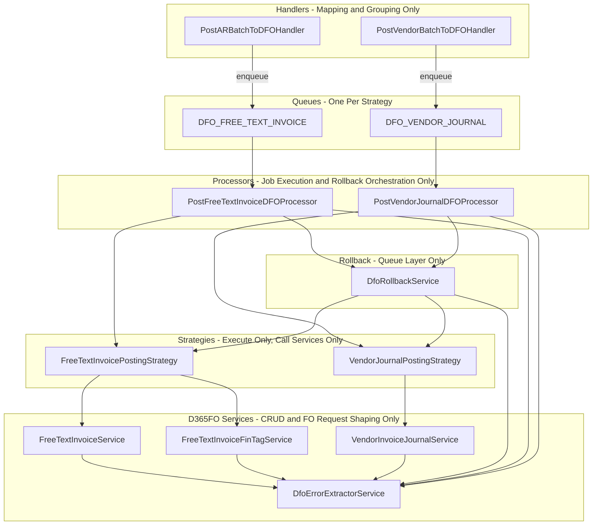

# D365FO Queue + Services Refactor — Final Plan

**Goal:** Clean architecture with strict ownership. No logic leakage between handlers, queue layer, and D365FO services.

---

## 1. Target Architecture



**Option A is the default:** One queue per posting strategy, one processor per queue, no mega-processor.

- **Worker concurrency:** Each queue can be tuned independently (e.g. FTI vs VJ concurrency). Easier to scale or throttle one flow without affecting the other.
- **Monitoring:** Per-queue metrics (waiting, active, failed) make it clear which flow is slow or failing.
- **Long-term:** Clear boundaries and smaller processors reduce merge conflicts and ease onboarding.

---

## 2. Responsibilities (Who Does What)

| Responsibility | Owner | Allowed | Forbidden |
|----------------|--------|---------|-----------|
| **Mapping / grouping** | Handlers | Domain → FO shapes, grouping by header/invoice | Queue logic, D365FO HTTP calls |
| **Job execution** | Processors | Receive payload, loop header-groups, call strategy, call rollback on failure, update batch status. Processors MUST NOT modify payloads. | Mapping, validation, rollback orchestration outside processor, any line/header payload mutation |
| **Rollback orchestration** | Processors only | Decide “on failure → rollback”, call `DfoRollbackService.rollbackAll(...)` | Strategies/services must not orchestrate rollback |
| **Rollback execution** | DfoRollbackService | Delete headers/lines via strategy (deleteHeader, deleteLinesInBatches) | Business rules, error parsing (use DfoErrorExtractorService) |
| **Execute D365FO calls** | Strategies | Call service methods only: createHeader, postLinesForHeader, deleteHeader, listLinesForHeader, etc. Strategies MUST NOT modify payloads or attach anything to lines. | Mapping line payloads, rollback decisions, queue logic, any `prepareLinesForPosting` or line mutation |
| **Line attachment / FO request shaping** | D365FO services only | HTTP/OData, attach headerKey to lines inside `postLinesForHeader(headerKey, lines)`, strip invalid fields (e.g. FullPrimaryRemittanceAddress). This MUST live ONLY in D365FO services. | Processors and strategies MUST NOT do line attachment or request shaping. **Remove `prepareLinesForPosting` from strategies.** |
| **FO CRUD** | D365FO services | Create/update/delete/get, post to FO, rollback as API calls only | Rollback orchestration, queue logic, business rules |
| **Error normalization** | DfoErrorExtractorService only | `normalize(error)` and `extractMessage(error)` | Any ad-hoc `error?.response?.data?.error...` anywhere else |
| **Logging** | Processors, strategies, services | Keep current level and context ([JOB], [POST], [ROLLBACK], etc.) | Reducing clarity or dropping context |

---

## 3. Contracts

### 3.1 Rollback Ownership Contract

- **Processor** is the only place that decides rollback and orchestrates it.
  - During execution it accumulates `createdHeaders: CreatedHeader[]`.
  - On any failure it calls `DfoRollbackService.rollbackAll(strategy, createdHeaders, chunkSize, errorCollector)`.
- **DfoRollbackService** is an execution helper only:
  - It deletes headers/lines via the strategy’s `deleteHeader` and `deleteLinesInBatches`.
  - It uses `DfoErrorExtractorService.normalize(error)` for logging and for dependent-lines retry (via `isDependentLinesError`).
  - It does not decide “whether” to rollback; the processor does.
- **Strategies** must not orchestrate rollback. They only expose delete/list/create/post methods used by the processor and by DfoRollbackService.
- **D365FO services** only expose DELETE/cleanup APIs (e.g. deleteHeader, deleteLine). No rollback business logic.

### 3.2 Line Attachment Ownership (Hard Rule — Mandatory)

**Line attachment / request shaping** (setting `JournalBatchNumber`, `ParentRecId`, removing invalid fields such as `FullPrimaryRemittanceAddress`, etc.) **MUST live ONLY inside D365FO services.**

- **Strategies MUST NOT** modify payloads or attach anything to lines. Strategies are pure: they only call `service.postLinesForHeader(headerKey, lines)` and forward the call; they do not touch line data.
- **Processors MUST NOT** modify payloads. Processors pass through the grouped data from the job and call the strategy; they never edit header or line payloads.

**Remove `prepareLinesForPosting` from strategies.** All logic that attaches a header key to lines or strips invalid fields belongs in the D365FO service method `postLinesForHeader(headerKey, lines, ...)`.

### 3.3 Strategy Interface (Execute Only)

Strategies **only** call D365FO services. No line payload mutation.

**Required strategy methods (conceptual):**

- `createHeader(header: THeader): Promise<string>` — create one header, return headerKey. (Or keep batch signature if the processor only ever passes one header per call.)
- `postLinesForHeader(headerKey: string, lines: TLine[], dataAreaId: string): Promise<Array<{ headerId: string; lineNumber: number }>>` — strategy **only** calls `service.postLinesForHeader(headerKey, lines, dataAreaId)`. The strategy does not modify `lines`; all attachment/shaping happens inside the **D365FO service**.
- `deleteHeader(headerId: string, dataAreaId: string): Promise<void>`
- `deleteLinesInBatches(lines: Array<{ headerId: string; lineNumber: number }>, dataAreaId: string, chunkSize: number): Promise<DeleteLinesResult>`
- `listLinesForHeader(headerKey: string, dataAreaId: string): Promise<Array<{ LineNumber: number }>>`

**Removed from strategy:** `prepareLinesForPosting`. It must be removed from the strategy interface and from all strategy implementations. Line attachment and request shaping live only in D365FO services.

Existing `postHeadersInBatches` / `postLinesInBatches` can remain as thin wrappers that call service methods, but the processor must call “one header + its lines” via something like `createHeader` + `postLinesForHeader` so that the strategy never mutates line payloads. Strategy’s `postLinesForHeader` forwards to service’s `postLinesForHeader` with no modification of the payload.

### 3.4 D365FO Service Contract (Line Attachment)

- **FreeTextInvoiceService** must implement `postLinesForHeader(headerKey: string, lines: D365FOFreeTextInvoiceLineRequest[], dataAreaId: string): Promise<Array<{ headerId: string; lineNumber: number }>>` where it:
  - Sets `ParentRecId` from `headerKey` on each line,
  - Then performs the POST(s). No such logic in processor or strategy.
- **VendorInvoiceJournalService** already has `postLinesForHeader(headerKey, lines, chunkSize, dataAreaId)`. Ensure it owns:
  - Setting `JournalBatchNumber = headerKey`,
  - Stripping `FullPrimaryRemittanceAddress`,
  - Then POST(s). No such logic in processor or strategy.

### 3.5 DfoErrorExtractorService — Normalized Output Shape (Required Type)

**`DfoErrorExtractorService.normalize()` MUST return this stable type. It is NOT optional; every caller MUST use this shape.**

```ts
// dfo-error-extractor.service.ts — exact contract
export type DfoErrorShape = {
  message: string;
  status?: number;
  code?: string;
  isConcurrencyConflict?: boolean;
  isDependentLinesError?: boolean;
  isValidationError?: boolean;
  raw?: unknown;
};

// Methods (required):
normalize(error: unknown): DfoErrorShape;
extractMessage(error: unknown): string;  // MUST return normalize(error).message
```

**Rules:**

- No ad-hoc parsing anywhere (`error?.response?.data?.error...`). All callers use `DfoErrorExtractorService.normalize(error)` or `extractMessage(error)`.
- Rollback service and processors use `normalize(error).isDependentLinesError` / `normalize(error).isConcurrencyConflict` instead of parsing message strings.
- D365FO services use `extractMessage(error)` for logging and rethrow; retry logic uses `normalize(error)`.

---

## 4. Strongly Typed Job Payload Contracts

**Free-text-invoice queue** (`DFO_FREE_TEXT_INVOICE`):

```ts
// e.g. src/modules/queue/contracts/post-free-text-invoice-dfo-job.contract.ts
export interface PostFreeTextInvoiceDFOJobPayload {
  batchId: string;
  company: string;
  groupedInvoices: Array<{
    header: D365FOFreeTextInvoiceHeaderRequest;
    lines: D365FOFreeTextInvoiceLineRequest[];
    HeaderDefaultDimensionDisplayValue: string;
    LineFinTagDisplayValues: string[];
  }>;
  correlationId?: string;
  sourceModule?: 'AR';
}
```

**Vendor-journal queue** (`DFO_VENDOR_JOURNAL`):

```ts
// e.g. src/modules/queue/contracts/post-vendor-journal-dfo-job.contract.ts
export interface PostVendorJournalDFOJobPayload {
  batchId: string;
  company: string;
  groupedJournals: Array<{
    header: D365FOVendorInvoiceJournalHeaderRequest;
    lines: D365FOVendorInvoiceJournalLineRequest[];
  }>;
  correlationId?: string;
  sourceModule?: 'VENDOR';
}
```

Handlers and processors use these types; processors validate presence of `groupedInvoices` / `groupedJournals` and non-empty arrays only (no domain validation).

---

## 5. Folder and File Layout After Refactor

```
src/modules/
├── d365fo/
│   ├── services/
│   │   ├── dfo-error-extractor.service.ts   (NEW: normalize + extractMessage, DfoErrorShape)
│   │   ├── free-text-invoice.service.ts      (postLinesForHeader with ParentRecId; use DfoErrorExtractorService)
│   │   ├── free-text-invoice-fin-tag.service.ts (use DfoErrorExtractorService only)
│   │   ├── vendor-invoice-journal.service.ts   (postLinesForHeader owns JournalBatchNumber + strip; use DfoErrorExtractorService)
│   │   └── ...
│   └── d365fo.module.ts
├── queue/
│   ├── constants/
│   │   └── queues.ts                         (add DFO_FREE_TEXT_INVOICE, DFO_VENDOR_JOURNAL; keep DFO for shim)
│   ├── contracts/
│   │   ├── post-free-text-invoice-dfo-job.contract.ts  (NEW)
│   │   └── post-vendor-journal-dfo-job.contract.ts    (NEW)
│   ├── processors/
│   │   ├── post-free-text-invoice-dfo.processor.ts    (NEW, ≤30 lines per method)
│   │   ├── post-vendor-journal-dfo.processor.ts       (NEW, ≤30 lines per method)
│   │   ├── post-batch-dfo.processor.ts                (TEMPORARY: router-only compatibility shim)
│   │   └── ...
│   ├── services/
│   │   ├── dfo-rollback.service.ts          (use DfoErrorExtractorService.normalize; no ad-hoc parsing)
│   │   ├── posting-error-collector.service.ts
│   │   └── queue.service.ts
│   ├── strategies/
│   │   ├── dfo-posting-strategy.interface.ts (align with createHeader + postLinesForHeader; remove prepareLinesForPosting)
│   │   ├── free-text-invoice-posting.strategy.ts
│   │   └── vendor-journal-posting.strategy.ts
│   └── queue.module.ts
└── ... (handlers remain in AR / Vendor modules; they enqueue to new queues using payload contracts)
```

---

## 6. Implementation Order (With Migration Step)

1. **DfoErrorExtractorService**
   - Add `dfo-error-extractor.service.ts` with `DfoErrorShape`, `normalize()`, `extractMessage()`.
   - Register in D365FO module; inject into D365FO services, then into rollback service and processors.

2. **Replace all error parsing**
   - D365FO services: remove private `extractErrorDetails`; use `DfoErrorExtractorService.extractMessage` / `normalize`.
   - DfoRollbackService: use `normalize(error).isDependentLinesError` (and similar) instead of string checks.
   - Processors: use `extractMessage(error)` for logging and error collector.

3. **Line attachment in services only**
   - Ensure `FreeTextInvoiceService.postLinesForHeader(headerKey, lines, dataAreaId)` sets `ParentRecId` and performs POSTs.
   - Ensure `VendorInvoiceJournalService.postLinesForHeader(...)` sets `JournalBatchNumber`, strips `FullPrimaryRemittanceAddress`, and performs POSTs.
   - **Remove `prepareLinesForPosting` from strategies** (interface and all implementations). Strategy interface: add or standardize `postLinesForHeader(headerKey, lines, dataAreaId)` that only forwards to `service.postLinesForHeader(...)`; strategies must not modify payloads.

4. **New queues and processors**
   - Add `DFO_FREE_TEXT_INVOICE`, `DFO_VENDOR_JOURNAL` to `queues.ts`.
   - Add job payload contract files and types.
   - Implement `PostFreeTextInvoiceDFOProcessor` and `PostVendorJournalDFOProcessor` (methods ≤30 lines; helpers like `postOneGroup()`, `handleFailureAndRollback()`).
   - Wire handlers to enqueue to the new queues with the new payload types (`correlationId`, `sourceModule` optional).

5. **Transitional compatibility (router-only shim)**
   - Keep `post-batch-dfo.processor.ts` temporarily. Change it to a **router-only** implementation:
     - If job name is `post-vendor-batch-to-dfo` and payload has `groupedJournals` → add same payload to `DFO_VENDOR_JOURNAL` queue, then mark job completed (or remove from old queue if topology allows).
     - If job name is `post-free-text-invoice-batch-to-dfo` or `post-ar-batch-to-dfo` and payload has `groupedInvoices` → add same payload to `DFO_FREE_TEXT_INVOICE` queue, then mark job completed.
     - Otherwise → fail job with a clear “deprecated: use AR/Vendor handler and new queues” message.
   - Verify no old-style jobs remain in the legacy queue (monitoring, backlog drain).
   - Remove `post-batch-dfo.processor.ts` and its registration once safe.

6. **Cleanup and rules**
   - **Remove `prepareLinesForPosting`** from strategy interface and all strategy implementations. Confirm no processor or strategy mutates line/header payloads.
   - Enforce that processors use only `DfoRollbackService.rollbackAll` for rollback and that strategies never orchestrate rollback.
   - Final pass: logging unchanged, no duplicated error extraction, no business behavior change.

---

## 7. Rules Checklist (Enforceable)

Use this as a gate for reviews and refactor completion.

**Rollback**
- [ ] Only the processor decides “on failure → rollback” and calls `DfoRollbackService.rollbackAll(...)`.
- [ ] Strategies do not orchestrate rollback.
- [ ] D365FO services do not decide or orchestrate rollback; they only expose DELETE/cleanup APIs.

**Line attachment / mapping (mandatory)**
- [ ] Line attachment / request shaping (JournalBatchNumber, ParentRecId, removing invalid fields) lives **ONLY** in D365FO services inside `postLinesForHeader(headerKey, lines, ...)`.
- [ ] Strategies **MUST NOT** modify payloads or attach anything to lines. Strategy only calls `service.postLinesForHeader(headerKey, lines, dataAreaId)`.
- [ ] Processors **MUST NOT** modify payloads.
- [ ] **Remove `prepareLinesForPosting` from strategies** (interface and all implementations).

**Errors (DfoErrorShape is required)**
- [ ] `DfoErrorExtractorService.normalize(error)` returns the required type: `{ message: string; status?: number; code?: string; isConcurrencyConflict?: boolean; isDependentLinesError?: boolean; isValidationError?: boolean; raw?: unknown }`.
- [ ] `extractMessage(error)` is implemented as `normalize(error).message`.
- [ ] No ad-hoc parsing of `error?.response?.data?.error...` anywhere; rollback and retries use normalized flags.

**Processors**
- [ ] One processor per strategy; one queue per strategy (Option A).
- [ ] Each processor method is ≤30 lines; use helpers like `postOneGroup()`, `handleFailureAndRollback()`.
- [ ] No deep nesting; early returns and small conditionals.
- [ ] Job payloads use the typed contracts (`PostFreeTextInvoiceDFOJobPayload`, `PostVendorJournalDFOJobPayload`) including `batchId`, `company`, and optional `correlationId`, `sourceModule`.

**Compatibility**
- [ ] Old processor is replaced by a router-only shim that forwards to new queues or fails with a deprecated message.
- [ ] Shim is removed only after verifying no old jobs remain.

**Behavior and logging**
- [ ] No change to when/how batches are posted, rolled back, or how errors are stored.
- [ ] Logging stays at current level and context ([JOB], [POST], [ROLLBACK], [FIN TAG], etc.).

---

## 8. Summary

- **Handlers:** Mapping + grouping only; enqueue to `DFO_FREE_TEXT_INVOICE` or `DFO_VENDOR_JOURNAL` with typed payloads.
- **Processors:** Execute only; orchestrate rollback via `DfoRollbackService.rollbackAll` on any failure; use `DfoErrorExtractorService` for errors; methods ≤30 lines.
- **Strategies:** Execute only; call services only; **MUST NOT** modify payloads or attach anything to lines. **Remove `prepareLinesForPosting`** from strategies.
- **D365FO services:** CRUD + FO request shaping (line attachment and invalid-field stripping **ONLY** inside `postLinesForHeader`); no rollback logic.
- **DfoErrorExtractorService:** `normalize()` returns the required `DfoErrorShape` type; `extractMessage(error)` = `normalize(error).message`; no ad-hoc parsing elsewhere.
- **Migration:** Router-only shim for the old processor until legacy jobs are drained, then remove it.
