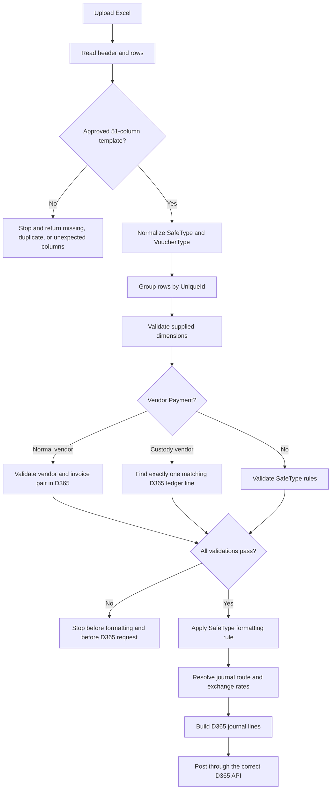

# Cash-Out Enhancements: Business Lifecycle

This document explains the cash-out process in business terms. It covers Azure
feature 2062 and its three child backlog items: 2063, 2065, and 2066.

## 1. The Main Business Words

### What is a source row?

A source row is one row in the uploaded Excel file. It describes one accounting
side of a cash transaction. Several source rows can have the same `UniqueId`.
Those rows belong to one business transaction.

### What is a D365 line?

A D365 line is one journal line sent by the middleware to Dynamics 365 Finance.
It contains an account, a debit or credit amount, dimensions, and sometimes an
offset account.

### What is the main account side?

The main account side is the account shown in `AccountType` and
`AccountDisplayValue`.

Examples:

| AccountType  | Business meaning                                                 |
| ------------ | ---------------------------------------------------------------- |
| `Vend`       | The company owes or pays a vendor.                               |
| `Ledger`     | A general-ledger account, such as withholding tax or an expense. |
| `Bank`       | A bank account.                                                  |
| `Cust`       | A customer account.                                              |
| `Petty Cash` | A custody or petty-cash account.                                 |

### What is an offset?

An offset is the other side of the same D365 journal line. For example, a vendor
payment line can have:

- Main side: vendor debit for 10,000.
- Offset side: bank credit for 10,000.

This is one D365 line with two accounting sides. Not every cash-out type uses an
offset. A multi-line transaction instead sends each debit and credit as its own
D365 line, with no generated offset.

### What is SafeType?

`SafeType` tells the middleware what the business transaction is. It is the
primary routing and formatting decision.

Supported outbound values are:

- `Vendor Payment`
- `Direct`
- `Other`
- `Down Payment`
- `Custody Issue`
- `Customer Collection`
- `Custody Settlement`

If outbound `SafeType` is empty, the middleware treats it as
`Custody Settlement`.

### What is VoucherType?

`VoucherType` explains how the money moved, such as `Cash`, `Transfer`,
`Cheque`, or `Visa`. It is secondary to `SafeType`. It can affect details such
as payment method and text, but it does not replace the SafeType business rule.

### What is marking?

Marking tells D365 to settle a payment against a specific existing invoice.
The `MarkedInvoice` value identifies that invoice.

- Normal vendor: the target is an existing vendor invoice.
- Custody vendor: the target is an existing ledger journal line.
- Non-Vendor-Payment SafeTypes: no marking is performed.

### What is withholding?

Withholding is tax retained from the vendor payment. In the supplied files it is
normally represented by ledger account `223304`.

Its treatment depends on `SafeType`:

- `Vendor Payment`: withholding is absorbed into the gross vendor line and is
  not sent as a second D365 output line.
- `Custody Settlement`: withholding remains a separate D365 line.
- Other SafeTypes: withholding is rejected because it is not supported by the
  approved business matrix.

## 2. Complete Cash-Out Lifecycle

### Step 1: Read the Excel file

The middleware reads both the header and the data rows. This is important
because reading only the rows cannot detect a renamed, missing, or duplicated
column.

### Step 2: Validate the template

The file must match the approved 51-column cash template. The same structure is
accepted for all three supplied variants and for both Fleet and Freight.

The request stops with a clear error when a column is:

- Missing.
- Unexpected.
- Duplicated.
- Blank.

No accounting transformation starts when the structure is invalid.

### Step 3: Normalize the business type

The middleware standardizes SafeType spelling and capitalization. For outbound
files only, an empty SafeType becomes `Custody Settlement`. This supports the
legacy null-SafeType workbook without changing cash-in behavior.

### Step 4: Group rows into transactions

Rows with the same `UniqueId` form one transaction. The system checks that one
group does not mix different SafeTypes. A mixed group is rejected because it
would have two conflicting accounting treatments.

### Step 5: Validate before formatting

Validation is performed on the source values before lines are combined or
rewritten.

The system validates:

- Every supplied financial dimension.
- Main and explicitly supplied offset accounts.
- Vendor and invoice pairs for normal Vendor Payment.
- Custody settlement targets for custody vendors.
- Vendor Payment shape: vendor debit line and one non-withholding credit side.
- Withholding use against the SafeType matrix.

Optional empty dimensions are skipped. If an optional dimension has a value,
that value must exist in D365 master data.

When any validation fails, the whole request stops before formatting and before
posting to D365. Errors identify the source row, field, and business reason.

### Step 6: Format according to SafeType

| SafeType                | D365 output                 | Offset                      | Withholding                   | Marking |
| ----------------------- | --------------------------- | --------------------------- | ----------------------------- | ------- |
| Vendor Payment          | One output per vendor debit | Payment side becomes offset | Merged into gross vendor line | Yes     |
| Direct                  | Preserve source lines       | No generated offset         | No                            | No      |
| Other                   | Preserve source lines       | No generated offset         | No                            | No      |
| Down Payment            | Preserve source lines       | No generated offset         | No                            | No      |
| Custody Issue           | Preserve all source lines   | No generated offset         | No                            | No      |
| Customer Collection     | Preserve all source lines   | No generated offset         | No                            | No      |
| Custody Settlement      | Preserve all source lines   | No generated offset         | Separate line                 | No      |
| Empty outbound SafeType | Same as Custody Settlement  | No generated offset         | Separate line                 | No      |

"Preserve source lines" means a source debit remains a debit line and a source
credit remains a credit line. The middleware does not invent an offset to
collapse the transaction.

### Step 7: Route to the correct journal and API

SafeType selects the journal family and posting route. Vendor Payment continues
through the vendor-payment behavior that supports invoice settlement. Customer
Collection uses the customer-payment route. Other approved types use their
configured general-journal route.

Only routes that support marking receive marking or unmarked fallback behavior.
This prevents marking logic from leaking into Direct, Other, Custody Issue, or
Custody Settlement transactions.

## 3. Vendor Payment Example From OUT-JAN

One real transaction in `OUT-JAN.xlsx` has `UniqueId` 468173:

| Source row        |   Debit |  Credit | Meaning                         |
| ----------------- | ------: | ------: | ------------------------------- |
| Vendor            | 105,222 |       0 | Gross amount owed to the vendor |
| Bank/payment side |       0 | 104,299 | Net cash paid                   |
| Ledger 223304     |       0 |     923 | Withholding retained            |

The accounting balances because:

`105,222 vendor debit = 104,299 bank credit + 923 withholding credit`

For `Vendor Payment`, the middleware creates one D365 vendor line:

- Main account: vendor.
- Debit amount: 105,222 gross amount.
- Offset: the payment account.
- Withholding enabled: yes.
- Withholding group: copied from the source tax information.
- Marked invoice: populated only after the D365 target is validated.
- Separate 223304 output line: no.

The separate tax source row is still used for validation and withholding
metadata, but it is not posted twice.

For `Custody Settlement`, the result is intentionally different. The vendor,
payment, and 223304 source rows remain separate D365 lines because this SafeType
uses multi-line accounting and does not perform invoice marking.

## 4. Normal Vendor and Custody Vendor Validation

### Normal vendor

Before formatting, the middleware checks D365 vendor invoice data using both:

- Vendor account.
- Invoice number.

Both must match. Finding the invoice number under another vendor is not enough.
If no exact pair exists, processing stops with a validation error.

### Custody vendor

A custody vendor does not settle against a normal vendor invoice. It targets a
previous D365 ledger journal line. The middleware matches all four values:

- `Document` number.
- `Currency`.
- Absolute amount, from debit or credit.
- Operation number, which is the first segment of `FinTagDisplayValue`.

Exactly one D365 line must match.

- Zero matches: stop because the target does not exist.
- One match: continue and retain the target identity for settlement.
- More than one match: stop because the target is ambiguous.

## 5. What Each Azure Backlog Item Delivered

### PBI 2063: Accept all approved cash-out templates

- Reads and validates the complete header before processing rows.
- Supports the null-SafeType settlement file, the explicit settlement file,
  and the mixed OUT file.
- Uses the same validation for Fleet and Freight.
- Returns specific structural errors instead of failing later with an unclear
  accounting error.

### PBI 2065: Apply the cash-out business matrix

- Makes SafeType the primary business decision and VoucherType secondary.
- Defaults empty outbound SafeType to Custody Settlement.
- Formats Vendor Payment as vendor main plus payment offset.
- Merges Vendor Payment withholding into the gross vendor output.
- Supports multiple vendor invoices inside one payment group.
- Preserves multi-line transactions without creating offsets.
- Limits marking to Vendor Payment and supports normal invoice and custody
  ledger targets.
- Adds Customer Collection routing.

### PBI 2066: Validate before formatting and posting

- Validates every supplied dimension while allowing optional blanks.
- Validates normal vendor and invoice pairs against D365.
- Validates custody targets by document, currency, amount, and operation.
- Requires exactly one custody ledger match.
- Stops the request before formatting or D365 posting when any source value is
  invalid.
- Returns business-readable row and field errors.

## 6. Verification With Supplied Files

The automated tests open the actual workbooks from
`src/excel-sources/Cash/cash_out_enhancement` with the application's ExcelJS
adapter.

| Workbook                                       | Source rows | Main verification                                                      |
| ---------------------------------------------- | ----------: | ---------------------------------------------------------------------- |
| `Custody Settlement - Jan - safetyp null.xlsx` |         904 | Empty SafeType becomes Custody Settlement; all rows remain multi-line. |
| `IN-JAN-Custody Settlement.xlsx`               |         584 | Explicit Custody Settlement preserves all rows.                        |
| `OUT-JAN.xlsx`                                 |       4,134 | Mixed SafeTypes follow their own rules; Vendor Payment tax is merged.  |

Both Fleet and Freight processors are exercised. The focused verification has
107 passing tests across 12 suites, and the Nest TypeScript build succeeds.

The workbook tests mock live D365 responses because a test run must not post or
depend on production finance data. Separate service and processor tests cover
normal vendor lookup, exact custody matching, missing targets, duplicate
targets, invalid dimensions, and valid optional blanks.
